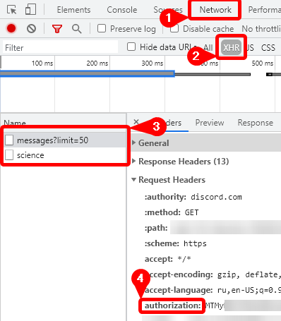
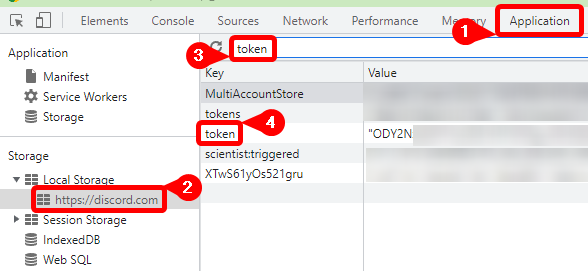

# discord-emoji-export

Site for exporting emojis and stickers from any discord server you are in.

## Features

* Browse emojis in server
* Browse stickers in server (except lottie)
* Download emojis in ZIP archive
* Download stickers in ZIP archive
* Export emojis as JSON (with links to emojis)

## How to get Discord token

### Using network tab

* Open development console (`F12` or `Ctrl + Shift + I`)
* Switch channel or server
* Go to Network tab
* Turn on XHR filter
* Select any request
* Find authorization header



### Using application tab (browser only)

* Open development console (`F12` or `Ctrl + Shift + I`)
* Go to Application tab
* Select local storage
* Search for `token` key



## Running locally

1. Clone repository

2. Install depencies

    ```bash
    yarn
    ```

3. Build and start server

    ```bash
    yarn run start
    ```

4. Open: <http://localhost:8080>

## JSON format

```json
{
    "guildName": "<name>",
    "guildID": "<id>",
    "emojis": [
        {
            "name": "<name>",
            "id": "<id>",
            "identifier": "<a?>:<name>:<id>",
            "url": "https://cdn.discordapp.com/emojis/<id>.<png|gif>"
        },
    ]
}

```
