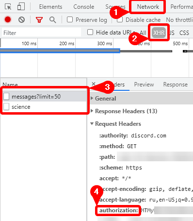
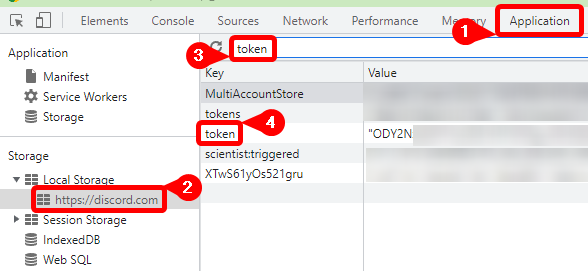

# discord-emoji-export [![Build artifact][build-src]][build-href] [![Netlify Status][netlify-src]][netlify-href]

Website for exporting emojis and stickers from any discord server you are in.


## Features

* Browse emojis in server
* Browse stickers in server
* Download emojis in ZIP archive
* Download stickers in ZIP archive
* Export emojis as JSON (with links to emojis)

## How to get Discord token

### Using network tab

* Open development console (`F12` or `Ctrl + Shift + I`)
* Switch channel or server
* Go to Network tab
* Turn on XHR filter
* Select any request
* Find authorization header



### Using application tab (browser only)

* Open development console (`F12` or `Ctrl + Shift + I`)
* Go to Application tab
* Select local storage
* Search for `token` key



## Running locally

1. Clone repository

2. Install dependencies

```bash
yarn
```

3. Build and start dev server

```bash
yarn dev
```

4. Open: <http://localhost:3000>

## [JSON schema](https://virenbar.github.io/discord-emoji-export/schemas/emojis.schema.json)

```json
{
    "guildName": "<name>",
    "guildID": "<id>",
    "emojis": [
        {
            "name": "<name>",
            "id": "<id>",
            "identifier": "<a?>:<name>:<id>",
            "url": "https://cdn.discordapp.com/emojis/<id>.<png|gif>"
        },
    ]
}

```

## CORS proxy

Website uses [CORS proxy][schema-href] for stickers

<!-- Badges -->
[build-src]: https://img.shields.io/github/actions/workflow/status/Virenbar/discord-emoji-export/build.yml?label=Build&logo=github
[build-href]: https://github.com/Virenbar/discord-emoji-export/actions/workflows/build.yml

[netlify-src]: https://api.netlify.com/api/v1/badges/3c01e6cb-873d-4858-bef8-bf82eff1fab7/deploy-status
[netlify-href]: https://app.netlify.com/sites/virenbar-discord-emoji/deploys

<!-- Other -->
[schema-href]: https://github.com/Virenbar/cloudflare-cors-proxy
